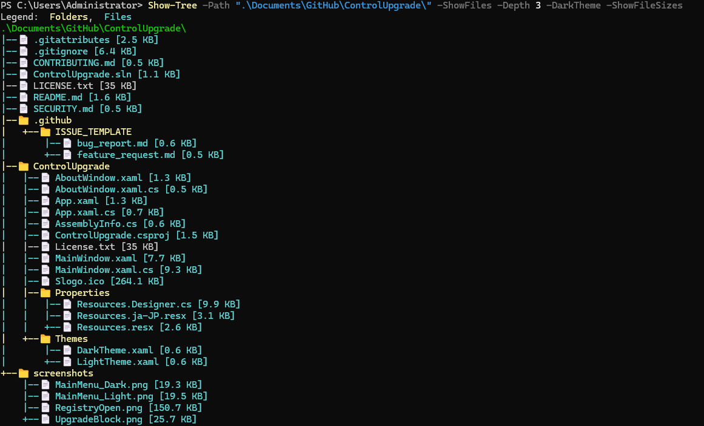

# TreePlus

**TreePlus** is a PowerShell module that displays a tree-like structure of folders (and optionally files) with support for emojis, color-coded file types, clipboard export, and markdown output—ideal for use in documentation, terminals, or GitHub READMEs.

---

## ✨ Features

- ✅ Recursive folder and file listing
- 📁 Folder and 📄 file emojis (optional)
- 🎨 File extension–based color themes
- 📄 Markdown-formatted tree output for GitHub
- 📋 Clipboard export support
- 🗂️ Depth control, file filtering, hidden file visibility
- 🧪 Built-in Pester tests

---

## 💡 Why TreePlus?

PowerShell’s built-in `tree` command is dated and lacks modern features. **TreePlus** was built to provide a cleaner, richer, and more customizable tree-view experience. Here's what sets TreePlus apart:

| Feature                | TreePlus ✅ | Legacy Tree ❌ |
|------------------------|-------------|----------------|
| Emoji support (📁 📄)   | Yes         | No             |
| Markdown export        | Yes         | No             |
| Clipboard integration  | Yes         | No             |
| Color-coded extensions | Yes         | No             |
| File size display      | Yes         | No             |
| Hidden item handling   | Yes         | No             |
| Exclude folders        | Yes         | No             |
| Extension filters      | Yes         | No             |

> 💬 **Note**: Emoji support requires **PowerShell 7+** and a compatible font. PowerShell 5.x typically does not render emojis properly in the terminal.

---

## 🚀 Installation

Install from the PowerShell Gallery:
```powershell
Install-Module -Name TreePlus
```
---
## Usage examples
```powershell
# Basic Tree of folders Only
Show-Tree -Path "C:\Projects"

# Include file and file sizes
Show-Tree -Path "C:\Projects" -ShowFiles -ShowFileSizes

# Limit tree depth
Show-Tree -Path "C:\Projects" -Depth 2

# Filter by Extension
Show-Tree -Path "C:\Scripts" -ShowFiles -IncludeExtensions ".ps1", ".psm1"

# Exclude Folders
Show-Tree -Path "." -ExcludeFolders ".git", "node_modules"

# Output to MarkDown for README etc
Show-Tree -Path "." -ShowFiles -MarkdownOutput -OutputFile "tree.md"

# Copy Tree to Clipboard
Show-Tree -Path "." -ShowFiles -ToClipboard

```
---

## Screenshots

### 🌙 Dark Theme with Emojis


---

## 📁 Example Output

This example demonstrates the output of `Show-Tree` in Markdown mode.

<details>
<summary>📂 <code>.\Documents\GitHub\ControlUpgrade\</code> (click to expand)</summary>

```markdown
# Directory Tree: .\Documents\GitHub\ControlUpgrade\
- .gitattributes
- .gitignore
- CONTRIBUTING.md
- ControlUpgrade.sln
- LICENSE.txt
- README.md
- SECURITY.md
- .github
  - ISSUE_TEMPLATE
- ControlUpgrade
  - AboutWindow.xaml
  - AboutWindow.xaml.cs
  - App.xaml
  - App.xaml.cs
  - AssemblyInfo.cs
  - ControlUpgrade.csproj
  - License.txt
  - MainWindow.xaml
  - MainWindow.xaml.cs
  - Slogo.ico
  - Properties
  - Themes
- screenshots
  - MainMenu_Dark.png
  - MainMenu_Light.png
  - RegistryOpen.png
  - UpgradeBlock.png
```
</details>

## Emoji Support

Emojis (📁, 📄) are only shown if:

-PlainAscii is not used

-MarkdownOutput is not used

PowerShell 7+ (with UTF-8 support) is required for emoji output to display correctly in most terminals

In Windows PowerShell 5.1, emojis may not render correctly or at all

Use -PlainAscii to disable emojis if needed:
```powershell
Show-Tree -Path "." -PlainAscii
```

## 🙌 Contributing
Contributions are welcome! Feel free to open issues or submit pull requests.

